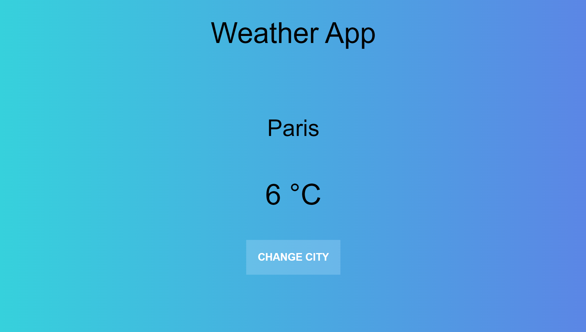

# geo-weather-app-ntl-serverless-functions

A weather application that collects weather data from any city in the world, thanks to OpenWeatherMap API.

- [Stack](#stack)
- [Screenshot](#screenshot)
- [Main features](#main-features)
- [Warning message about geolocation](#warning)
- [Run the project locally](#run-the-project-locally)
- [Getting started with Create React App](#getting-started-with-create-react-app)
  - [Available scripts](#available-scripts)
  - [Learn more](#learn-more)
- [Run the project locally](#run-the-project-locally)
- [Contributing](#contributing)
- [Stay Updated](#stay-updated)
- [Contact](#contact)

## Stack

This project has been created with **React** using **Netlify serverless functions**.

The weather data are fetched from [**OpenWeatherMap API**](https://openweathermap.org/api).

## Screenshot

## Main features

- Collect weather data from any city in the world using a prompt button.
- Get weather data from user's geolocation (optional).

## Warning message about geolocation

If you want to use geolocation in your app, you must know that you will not be able to hide your API key on your server because the JavaScript navigator object is used for browser detection. Therefore, the latter must necessarily access your API key in order to get your local device geographical position.

To use geolocation, you must follow the instructions given in the comments of App.js file, notably by replacing the template literals (${apiKey}) by your own API key.

To get an API key, you must first create an account on [OpenWeatherMap API website](https://openweathermap.org/).

**!!!!!!!!!! DO NOT PUSH YOUR EXPOSED API KEY ON GITHUB !!!!!!!!!!!**

## Run the project locally

1. Open your terminal and navigate to the location where you want the local repository to be copied.
2. Clone the repository : `git clone https://github.com/jesselessa/geo-weather-app-ntl-serverless-functions.git`
3. Navigate to the project directory : `cd geo-weather-app-ntl-serverless-functions`
4. Inside the project directory :
  - Install the project dependencies : `npm install`
  - Run the application in development mode using Netlify serverless functions : `netlify dev` or its shortcut `ntl dev`
5. Open http://localhost:8888 in your browser to view the development server.

## Getting Started with Create React App

This project was bootstrapped with [Create React App](https://github.com/facebook/create-react-app).

### Available Scripts

In the project directory, you can run :

#### `npm start`

Runs the app in the development mode.\
Open [http://localhost:3000](http://localhost:3000) to view it in your browser.

The page will reload when you make changes.\
You may also see any lint errors in the console.

#### `npm test`

Launches the test runner in the interactive watch mode.\
See the section about [running tests](https://facebook.github.io/create-react-app/docs/running-tests) for more information.

#### `npm run build`

Builds the app for production to the `build` folder.\
It correctly bundles React in production mode and optimizes the build for the best performance.

The build is minified and the filenames include the hashes.\
Your app is ready to be deployed !

See the section about [deployment](https://facebook.github.io/create-react-app/docs/deployment) for more information.

#### `npm run eject`

**Note : this is a one-way operation. Once you `eject`, you can't go back !**

If you aren't satisfied with the build tool and configuration choices, you can `eject` at any time. This command will remove the single build dependency from your project.

Instead, it will copy all the configuration files and the transitive dependencies (webpack, Babel, ESLint, etc) right into your project so you have full control over them. All of the commands except `eject` will still work, but they will point to the copied scripts so you can tweak them. At this point you're on your own.

You don't have to ever use `eject`. The curated feature set is suitable for small and middle deployments, and you shouldn't feel obligated to use this feature. However we understand that this tool wouldn't be useful if you couldn't customize it when you are ready for it.

### Learn More

You can learn more in the [Create React App documentation](https://facebook.github.io/create-react-app/docs/getting-started).

To learn React, check out the [React documentation](https://reactjs.org/).

#### Code Splitting

This section has moved here : [https://facebook.github.io/create-react-app/docs/code-splitting](https://facebook.github.io/create-react-app/docs/code-splitting)

#### Analyzing the Bundle Size

This section has moved here : [https://facebook.github.io/create-react-app/docs/analyzing-the-bundle-size](https://facebook.github.io/create-react-app/docs/analyzing-the-bundle-size)

#### Making a Progressive Web App

This section has moved here : [https://facebook.github.io/create-react-app/docs/making-a-progressive-web-app](https://facebook.github.io/create-react-app/docs/making-a-progressive-web-app)

#### Advanced Configuration

This section has moved here : [https://facebook.github.io/create-react-app/docs/advanced-configuration](https://facebook.github.io/create-react-app/docs/advanced-configuration)

#### Deployment

This section has moved here : [https://facebook.github.io/create-react-app/docs/deployment](https://facebook.github.io/create-react-app/docs/deployment)

#### `npm run build` fails to minify

This section has moved here: [https://facebook.github.io/create-react-app/docs/troubleshooting#npm-run-build-fails-to-minify](https://facebook.github.io/create-react-app/docs/troubleshooting#npm-run-build-fails-to-minify)

## Contributing

- If you are interested in contributing, explore the project structure in the 'src' folder and modules installed in the 'package.json' file.
- Feel free to make improvements, fix bugs, or suggest new features.

## Stay updated

To stay updated with the project latest changes, you can pull them from the repository : `git pull origin main`

## Contact

For inquiries, contact me via [LinkedIn](https://www.linkedin.com/in/jessica-elessa/).

---

&copy; 2024, Jessica ELESSA - All rights reserved
